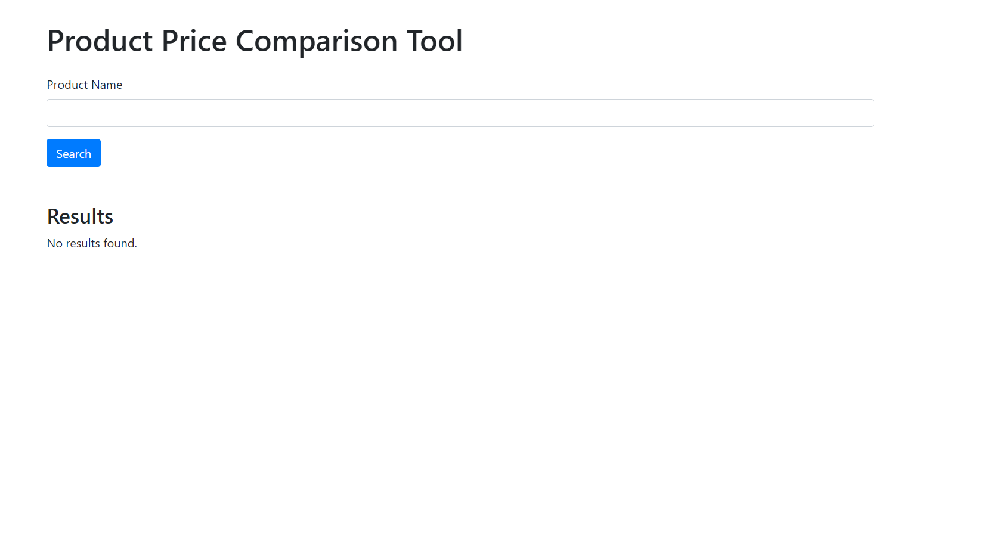

# Product price comparision tool
 Product Price Comparison Tool We'll create a simple tool to compare product prices from multiple e-commerce websites. This tool will include a Python script for web scraping and a basic web interface using Flask and HTML/CSS for user input and displaying results.

# Important
Install beautifulsoup4, scraper, flask before trying this tool
Run app.py file to test the tool

